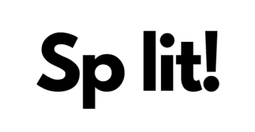
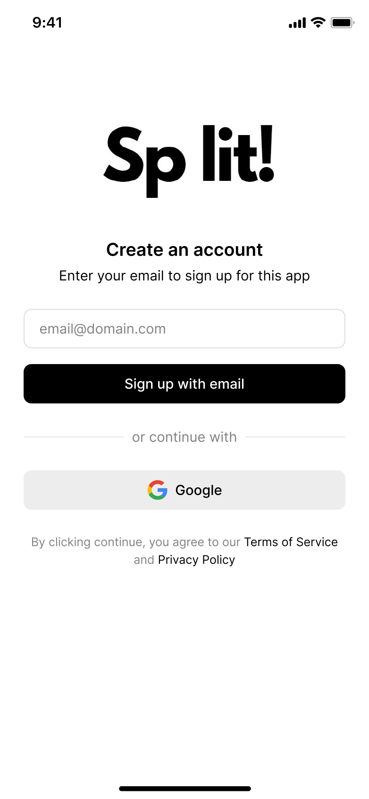
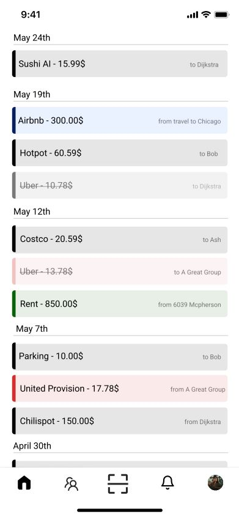
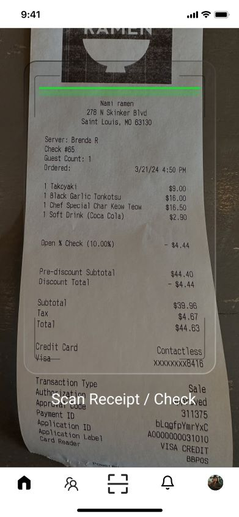
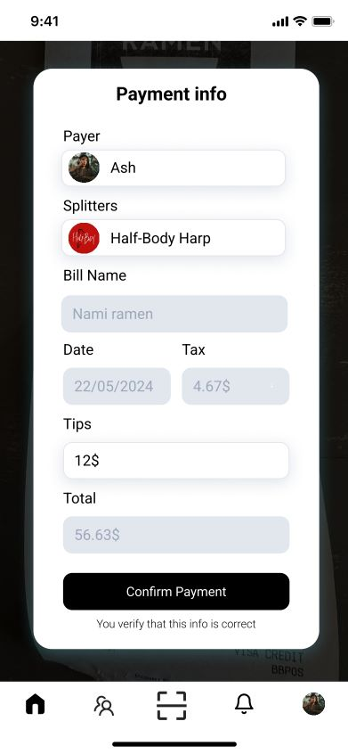
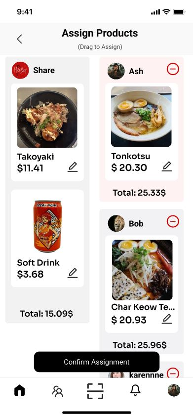
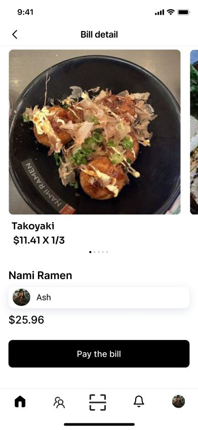

# Split! - an AI based Check Spliter

# 👀 Product Overview

> Split! is a tool designed to help users easily split bills. By scanning bills and utilizing OCR and GPT APIs, it automatically generates draggable item entries. Users can then allocate these items to group members through a graphical interface, simplifying the bill-splitting process. The target users include groups of friends who often dine out or shop together, small teams, roommates, and similar groups.

---

# 👥 Participants

> - Dijkstra Liu: Full-stack + Product Manager
> - Weilong Guan: Backend

---

# 💭 **Requirements Specification**

> Core Requirements:
>
> 1. Bill scanning using OCR technology to convert the content of the bill into text.
> 2. GPT analysis, using the GPT API to analyze the scanned results and generate formatted bill information.
> 3. Group creation, allowing users to create groups and invite members via invitation codes or by searching for IDs.
> 4. Bill viewing, enabling users to view bill details.
>
> Non-core Requirements:
>
> 1. User login and registration (based on Google account), and profile modification.
> 2. Group management, with the ability to set administrators (not just the default creator).
> 3. User guidance, with in-app tutorials.

# **Prototype**

[Check to view the Full Prototype in Figma](https://www.figma.com/proto/dRIgVFJzFgpSl5YeDcs5rU/Split?node-id=0-1&t=Uz3IuLstVCWGuvfb-1)

  
  

  
  

  
  

